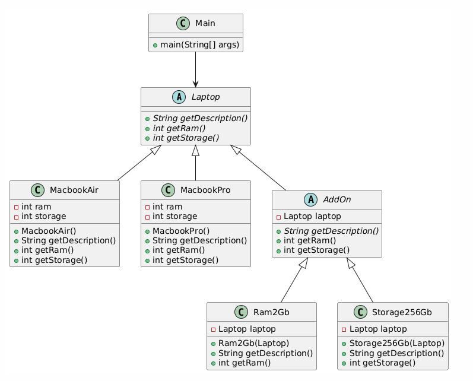

# Laptop Decorator Pattern

This project demonstrates the **Decorator Design Pattern** using different types of `Laptop` objects and adding additional features (like extra RAM and storage) dynamically at runtime.

The `Laptop` abstract class represents a base class, and concrete classes like `MacbookAir` and `MacbookPro` extend it. Additional functionalities such as extra RAM and storage are added through the `AddOn` decorator class, which also extends `Laptop`.

## Project Structure

1. **Laptop (abstract class)** - Defines the structure for laptops, requiring methods to get the description, RAM, and storage.
2. **MacbookAir and MacbookPro (concrete classes)** - Specific implementations of laptops with predefined RAM and storage values.
3. **AddOn (abstract class)** - The decorator base class that extends `Laptop`. Allows adding extra features dynamically to any `Laptop`.
4. **Ram2Gb and Storage256Gb (concrete decorators)** - Implementations of additional features that can be applied to a `Laptop` object, such as extra RAM and storage.
5. **Main class** - Contains the main method to demonstrate the functionality.

### UML Diagram

Here’s the UML diagram of the class relationships:



## How to Run

1. Clone the repository or download the source code.
2. Compile and run the `Main` class.
3. The console will print out the description and configuration of the `Laptop` as you add features dynamically.

## Example use
### Code 
```java
Laptop myLaptop = new MacbookPro();
System.out.println(myLaptop.getDescription());
myLaptop = new Storage256Gb(myLaptop);
System.out.println(myLaptop.getDescription());
myLaptop = new Ram2Gb(myLaptop);
System.out.println(myLaptop.getDescription());
```
###  Output

```text
Macbook Pro (12gb ram 1024gb storage)
Macbook Pro (12gb ram 1024gb storage) +256gb storage (additional)
Macbook Pro (12gb ram 1024gb storage) +256gb storage (additional) +2gb Ram (additional)
